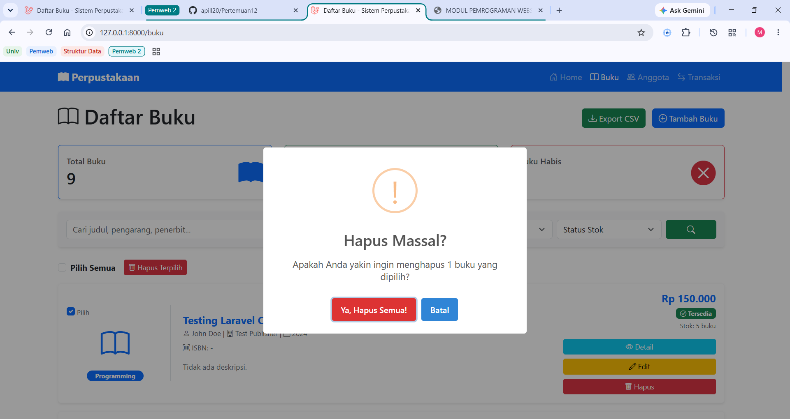
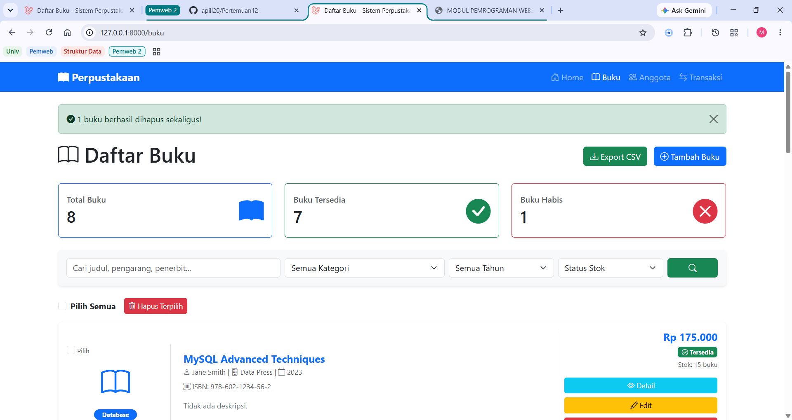

# Tugas Pemrograman Web 2 - Pertemuan 12

**Nama:** Ari Maulida Aprilia

**NIM:** 60324068 

---

## Tugas 1: Validation Rules Advanced (30%)

Implementasi custom validation rule dan conditional validation untuk memastikan integritas data buku yang diinputkan ke dalam sistem.

* **Custom Rule Kode Buku:** Format diwajibkan `BK-[Kategori]-[Nomor]` (contoh: BK-PROG-001).
* **Conditional Validation:** Jika kategori "Programming", maka bahasa wajib "Inggris". Jika tahun terbit < 2000, stok maksimal 5.
* **Custom Error Message:** Menggunakan bahasa Indonesia yang baik dan benar pada `StoreBukuRequest`.

**Bukti Hasil Testing Validasi:**

---

## Tugas 2: Bulk Delete Operations (35%)

Penambahan fitur hapus massal (*bulk delete*) menggunakan *checkbox* untuk mempermudah pengelolaan data buku dalam jumlah banyak sekaligus.

* Terintegrasi dengan fitur **Select All** menggunakan JavaScript.
* Menggunakan method `whereIn('id', $ids)->delete()` pada Controller untuk efisiensi *query* database.
* Dilengkapi dengan konfirmasi **SweetAlert** agar data tidak tidak sengaja terhapus.

**Bukti Hasil Bulk Delete:**

**Hasil Delete Berhasil:**

---

## Tugas 3: Export Buku ke CSV (35%)

Implementasi fitur *export* data untuk mengunduh seluruh rekap data buku dari database ke dalam format *Comma Separated Values* (.csv).

* Memanfaatkan fungsi *stream download* bawaan PHP/Laravel (`fputcsv` dan `fopen('php://output', 'w')`).
* Nama file *export* digenerate secara dinamis menggunakan *timestamp* (contoh: `buku_YYYY-MM-DD_HHMMSS.csv`).

**Hasil Export CSV:**

**Hasil Download CSV:**
